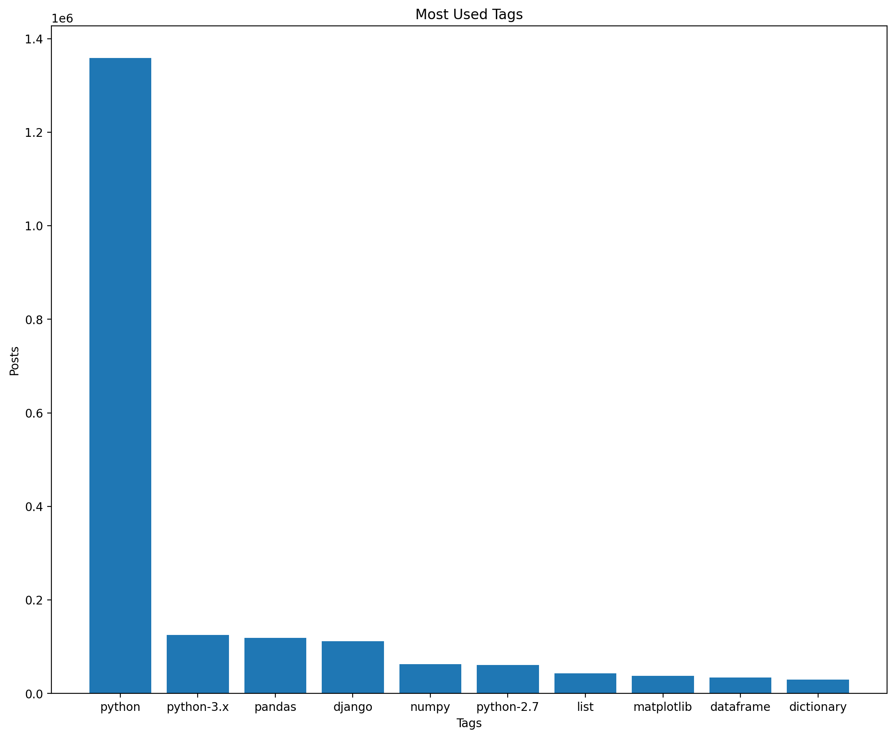
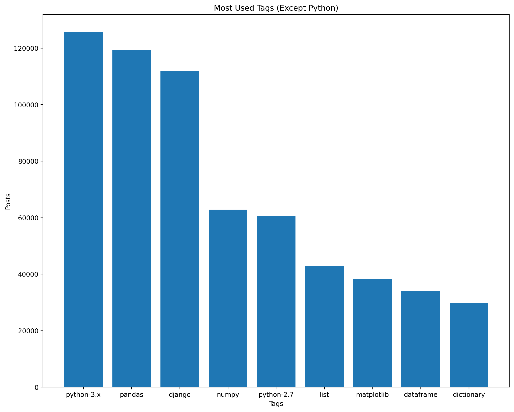
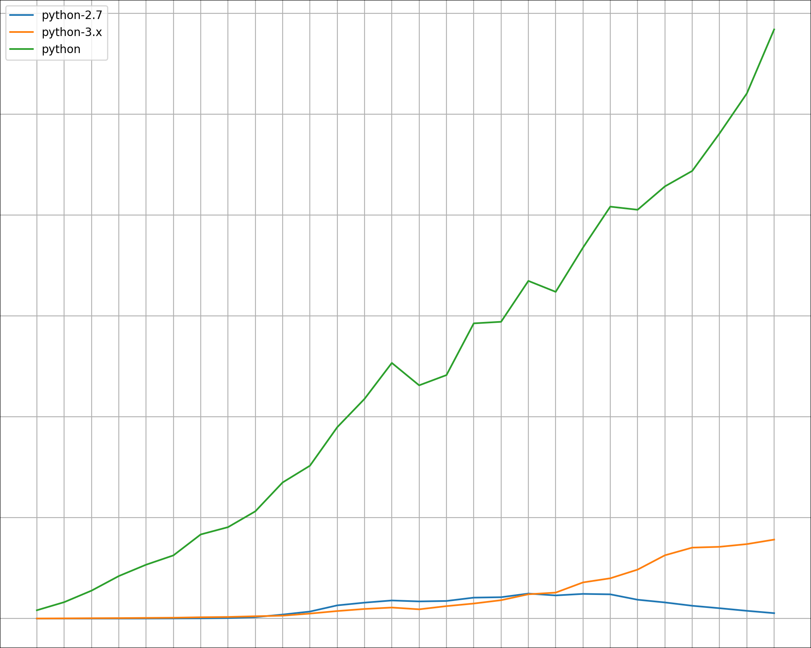
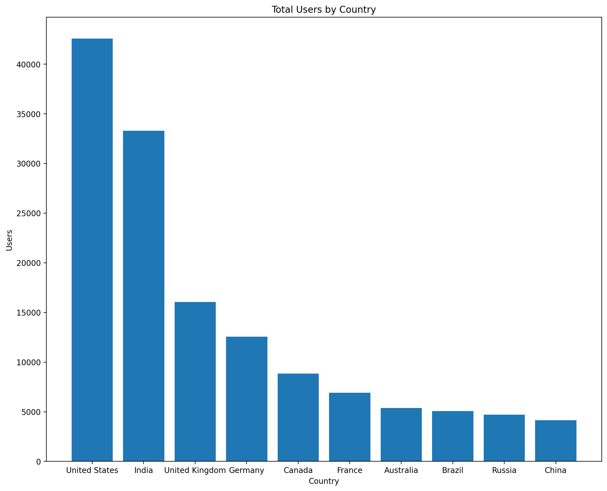
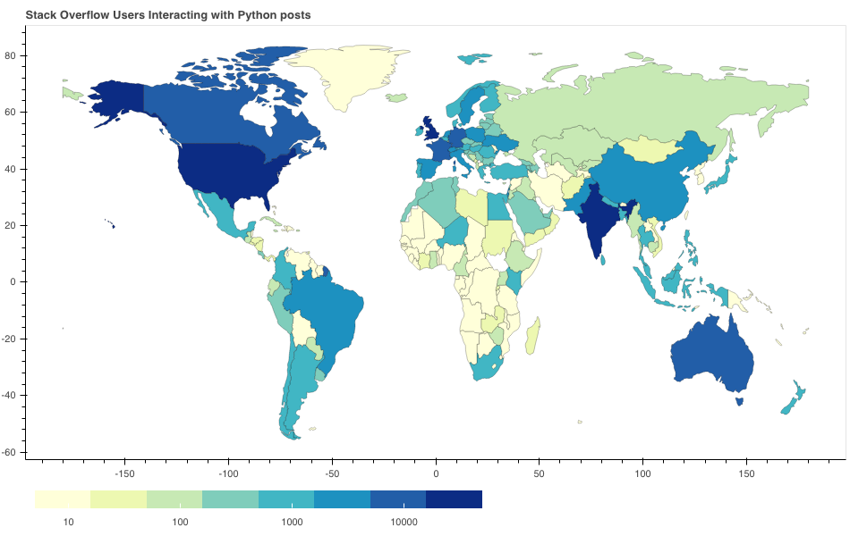
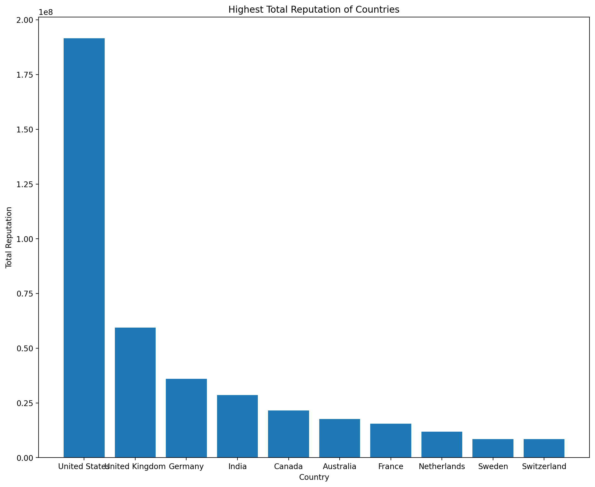
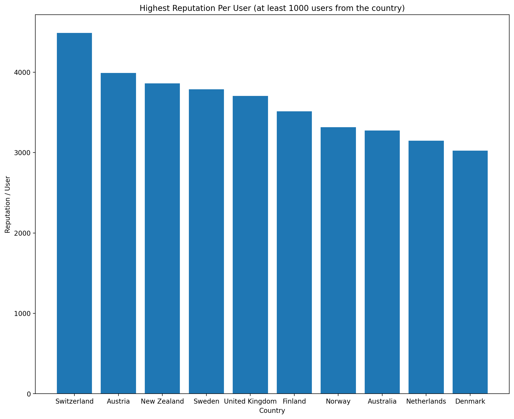
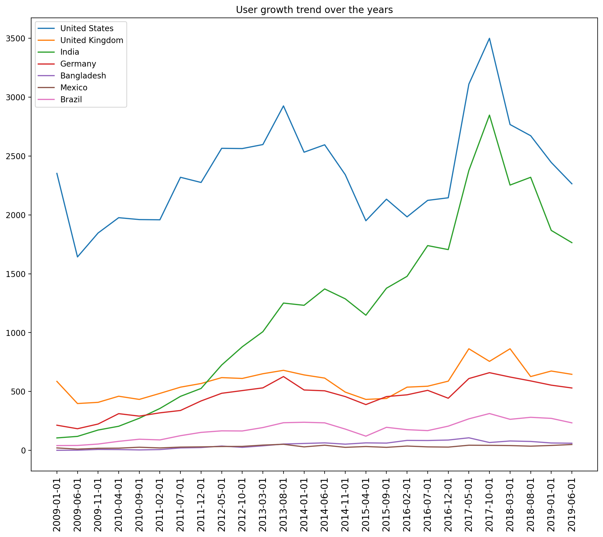

### Answer to specific questions
1. Criteria for subsampling of data is all the Question Posts have the tag "Python". All Answers are to these posts. The users and votes are also included if they created these posts or voted on them

2. I have created two word cloud
  - Word cloud for text part of the posts excluding the code
    
  - Word cloud for the code used in the posts
   
  Unsurprisingly these are python language keywords
  - Barplot for top 10 used tags (including Python)
   
  - Top 10 tags except python 
  
### Exploratory Analysis on Stack Overflow Dump
- Basic Stats:
  - Registered Users : 670395
  - Total Questions : 1358860
  - Total Answers:  2021741
  - Total Posts :  3380601
  - Total Votes : 13516747
- 3.05% of users make up of 50% of the posts
- 20.28% of users make up 80% of posts, which surprisingly lines up with the Pareto Principle
- Average posts which has been closed takes more than 3 months (101 days) to be closed
- Usage of different Python tags in new posts overtime 

The Python tag in new posts on the website reaching over 100000 posts in the last 5 month interval and it does not seem to slow down anytime soon.   
Python 2.7 had more new posts than Python 3.x till mid 2016 after which Python 3 has become the dominant tag. 
- 262141 Users had shared their location. By using pattern matching I was able to classify 90% of them into the country from which they belong to. Interestingly 37% of users of USA only mention their State name in their location unlike most users of rest of the world which mention their country. I suspect this has a lot of reasons including USA having a really strong federal structure, and USA being the biggest hub of IT  
The top ten countries with largest user bases.

USA is the largest making up about 24% of the users where as India makes up 12% of the users being second.  
We can also visualize this on a map.  

- Reputation is a point system on Stackoverflow which indicates how much helpful has a user has been. Using the previous data based on location we can visualize the most helpful countries on stack overflow. 

- I also used the number of users per country to calculate most and least helpful country per user. I have excluded countries with less than 1000 users since they skew the data.  
The most helpful countries are european countries on the platform.

- I also analyzed the growth of users from different countries overtime. These growth trends are only for Python related posts but we can clearly see the boom in Indian users over the past decade as India becomes an IT hub.
